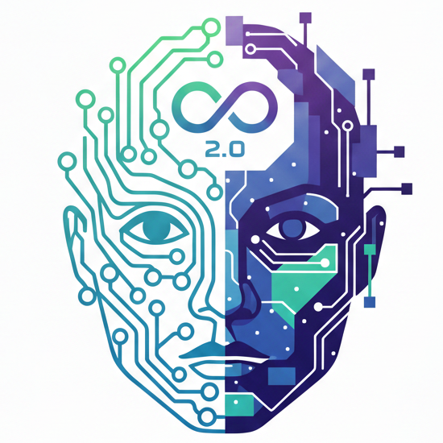
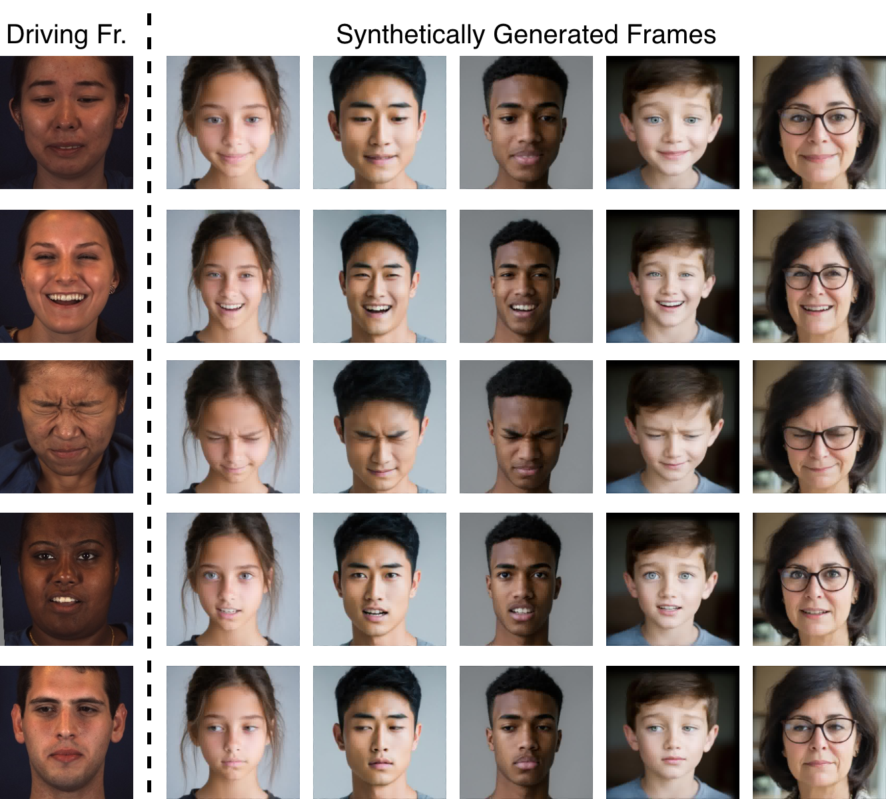
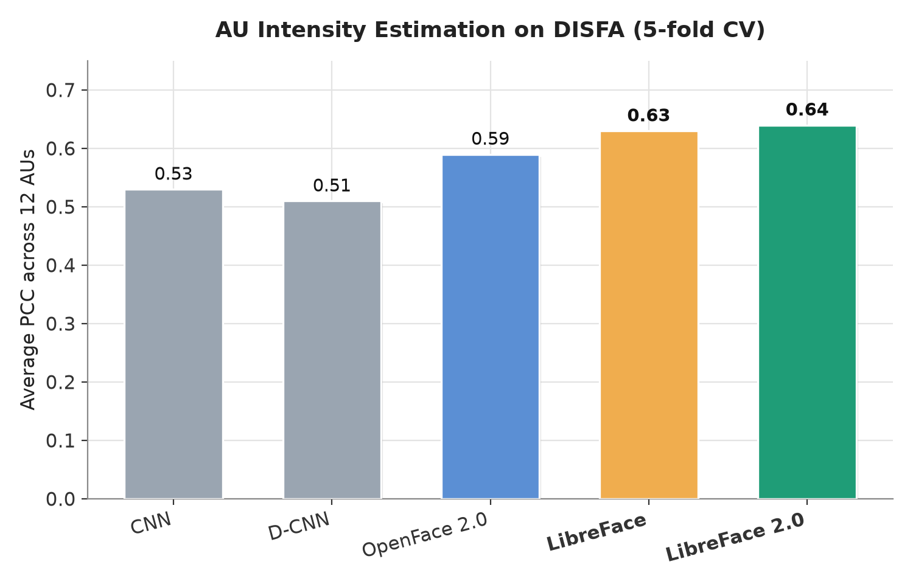
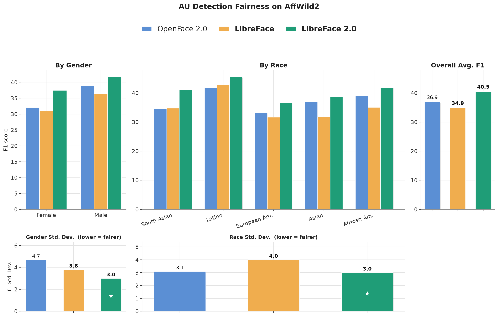

  

<div align="center">
  

  <h1 align="center">[FG 2026] LibreFace 2.0: A Generalizable Facial Expression Analysis Toolkit Leveraging Synthetic Data</h1>

<p align="center">

<a href="https://www.linkedin.com/in/xulang-guan-3040a6268/">
    Xulang Guan*</a>,
<a href="https://ashutoshchaubey.com/">
    Ashutosh Chaubey*</a>,
<a href="https://cv.maxi.su/">
    Maksim Siniukov</a>,
<a href="https://www.linkedin.com/in/belle-hsieh/">
    Annabelle Hsieh</a>,
<a href="https://scholar.google.com/citations?user=jqEgpukAAAAJ&hl=en">
    Zongjian Li</a>,
<a href="https://people.ict.usc.edu/~soleymani/">
    Mohammad Soleymani</a>
</p>
  
  <h1 align="center">[WACV 2024] LibreFace: An Open-Source Toolkit for Deep Facial Expression Analysis</h1>

  <p align="center">

<a href="https://boese0601.github.io/">
    Di Chang</a>,
<a href="https://yufengyin.github.io/">
    Yufeng Yin</a>,
<a href="https://scholar.google.com/citations?user=jqEgpukAAAAJ&hl=en">
    Zongjian Li</a>,
<a href="https://scholar.google.com/citations?user=HuuQRj4AAAAJ&hl=en">
    Minh Tran</a>,
<a href="https://people.ict.usc.edu/~soleymani/">
    Mohammad Soleymani</a>

<br>

<a href="https://ict.usc.edu/">Institute for Creative Technologies, University of Southern California</a>
<br />

[](https://ieeexplore.ieee.org/document/11556988)
[](https://arxiv.org/abs/2308.10713)
[](https://libreface.github.io/)
[](https://pypi.org/project/libreface/)
[](https://pypi.org/project/libreface/)
[](LICENSE.rst)
[](https://github.com/ihp-lab/LibreFace/stargazers)

</p>
</div>

## 📑 Table of Contents

- [Introduction](#introduction)
- [Getting started with Python installation](#getting-started-with-python-installation)
- [Usage](#usage)
  - [Using commandline](#using-commandline)
  - [Using Python script](#using-python-script)
- [Getting Started with Derivative Tools](#getting-started-with-derivative-tools-new-20-models-available-recommended)
- [Gaze estimation](#gaze-estimation-new-in-libreface-20)
- [Synthetic Data for LibreFace 2.0](#synthetic-data-for-libreface-20)
- [Training models](#training-models)
- [Results and Accuracy](#results-and-accuracy)
- [TODO](#todo)
- [License](#license)
- [Citation](#citation)
- [Contact](#contact)
- [Acknowledgments](#acknowledgments)

## 👋 Introduction

This is the official implementation of our WACV 2024 Application Track paper: LibreFace: An Open-Source Toolkit for Deep Facial Expression Analysis. The recent update (May 2026) incorporates the code and checkpoints for our FG 2026 paper "LibreFace 2.0: A Generalizable Facial Expression Analysis Toolkit Leveraging Synthetic Data". LibreFace is an open-source and comprehensive toolkit for accurate and real-time facial expression analysis with both CPU-only and GPU-acceleration versions. LibreFace eliminates the gap between cutting-edge research and an easy and free-to-use non-commercial toolbox. We propose to adaptively pre-train the vision encoders with various face datasets and then distillate them to a lightweight ResNet-18 and RepVGG models in a feature-wise matching manner. LibreFace 2.0 additionally supports gaze estimation using a MediaPipe landmark-based MLP pipeline. We conduct extensive experiments of pre-training and distillation to demonstrate that our proposed pipeline achieves comparable results to state-of-the-art works while maintaining real-time efficiency. LibreFace system supports cross-platform running, and the code is open-sourced in C# (model inference and checkpoints) and Python (model training, inference, and checkpoints).

<p align="center">
  
</p>

## 🚀 Getting started with Python installation

### 📦 Dependencies

- Python 3.9
- You should have `cmake` installed in your system.
    - **For Linux users** - `sudo apt-get install cmake`. If you run into trouble, consider upgrading to the latest version ([instructions](https://askubuntu.com/questions/355565/how-do-i-install-the-latest-version-of-cmake-from-the-command-line)).
    - **For Mac users** - `brew install cmake`.


### ⚙️ Installation

You can first create a new Python 3.9 environment using `conda` and then install this package using `pip` from the PyPI hub:

```console
conda create -n libreface_env python=3.9
conda activate libreface_env
pip install --upgrade libreface
```

### 🛠️ Usage

#### 💻 Using commandline

You can use this package through the command line using the following command.
```console
libreface --input_path="path/to/your_image_or_video"
```
Note that the above script would save results in a CSV at the default location - `sample_results.csv`.

<details>
<summary>More commandline options (custom output path, device, batch size, examples)</summary>

If you want to specify your own output path, use the `--output_path`  command line argument,
```console
libreface --input_path="path/to/your_image_or_video" --output_path="path/to/save_results.csv"
```

To change the device used for inference, use the `--device` command line argument,
```console
libreface --input_path="path/to/your_image_or_video" --device="cuda:0"
```

To save intermediate files, `libreface` uses a temporary directory that defaults to `./tmp`. To change the temporary directory path,
```console
libreface --input_path="path/to/your_image_or_video" --temp="your/temp/path"
```

For video inference, our code processes the frames of your video in batches. You can specify the batch size and the number of workers for data loading as follows,
```console
libreface --input_path="path/to/your_video" --batch_size=256 --num_workers=2 --device="cuda:0"
```

Note that by default, the `--batch_size` argument is 256, and `--num_workers` argument is 2. You can increase or decrease these values according to your machine's capacity.

**Examples**

Download a [sample image](https://github.com/ihp-lab/LibreFace/blob/main/examples/sample_disfa.png) from our GitHub repository. To get the facial attributes for this image and save to a CSV file, simply run,
```console
libreface --input_path="sample_disfa.png"
```

Download a [sample video](https://github.com/ihp-lab/LibreFace/blob/main/examples/sample_disfa.avi) from our GitHub repository. To run the inference on this video using a GPU and save the results to `my_custom_file.csv` run the following command,
```console
libreface --input_path="sample_disfa.avi" --output_path="my_custom_file.csv" --device="cuda:0"
```

Note that for videos, each row in the saved CSV file corresponds to individual frames in the given video.

</details>

#### 🐍 Using Python script

Here’s how to use this package in your Python scripts.

```python
import libreface 
detected_attributes = libreface.get_facial_attributes(image_or_video_path)
```

<details>
<summary>More Python API options (save to CSV, device, temp dir, batching, custom weights dir)</summary>

To save the results to a csv file, use the `output_save_path` parameter,
```python
import libreface 
libreface.get_facial_attributes(image_or_video_path,
                                output_save_path = "your_save_path.csv")
```

To change the device used for inference, use the `device` parameter,
```python

import libreface 
libreface.get_facial_attributes(image_or_video_path,
                                device = "cuda:0") # can be "cpu" or "cuda:0", "cuda:1", ...
```

To save intermediate files, libreface uses a temporary directory that defaults to `./tmp`. To change the temporary directory path, use the `temp_dir` parameter,
```python
import libreface 
libreface.get_facial_attributes(image_or_video_path,
                                temp_dir = "your/temp/path")
```

For video inference, our code processes the frames of your video in batches. You can specify the batch size and the number of workers for data loading as follows, 
```python
import libreface 
libreface.get_facial_attributes(video_path,
                                batch_size = 256,
                                num_workers = 2)
```

Note that by default, the `batch_size` is 256, and `num_workers` is 2. You can increase or decrease these values according to your machine's capacity.

Weights of the model are automatically downloaded at `./libreface_weights/` directory. If you want to download and save the weights to a separate directory, please specify the parent folder for weights using the `weights_download_dir` as follows,
```python
import libreface 
libreface.get_facial_attributes(image_or_video_path,
                                weights_download_dir = "your/directory/path")
```

</details>

<details>
<summary>Standalone gaze-only API (estimate_gaze / estimate_gaze_video)</summary>

```python
import libreface

aligned_image_path, _, _ = libreface.get_aligned_image("path/to/your_image.png", temp_dir="./tmp")
gaze = libreface.estimate_gaze(aligned_image_path, device="cpu")
print(gaze)  # {'gaze_yaw': <float>, 'gaze_pitch': <float>}
```

For videos, pass a list of aligned frame paths:

```python
import libreface

gaze_df = libreface.estimate_gaze_video(aligned_frames_path_list,
                                        device="cuda:0",
                                        batch_size=256,
                                        num_workers=2)
# gaze_df has columns "gaze_yaw" and "gaze_pitch", one row per frame.
```

</details>

## 🧩 Getting Started with Derivative Tools (New 2.0 Models Available! Recommended)

We offer several derivative tools on the .NET platform to facilitate easier integration of LibreFace into various systems, in addition to pytorch code. These works are based on ONNX platform weights exported from the model weights of this project.

<p align="center">
  
</p>

+ NuGet Package: We have released a [NuGet Package named `LibreFace`](https://www.nuget.org/packages/LibreFace). This NuGet Package contains the ONNX weight files, and its source code is located in [this directory of the OpenSense repository](https://github.com/ihp-lab/OpenSense/tree/master/Utilities/LibreFace). For how to integrate it, you can refer to the documentation that comes with the Package or the source code of the OpenSense Component below. This Package is cross-platform compatible and is recommended to be used with an ONNX Runtime Execution Provider with acceleration features. For non-.NET developers, you can access the ONNX weight files inside the package by changing the extension from `.nupkg` to `.zip`.

+ OpenSense Component: We have also wrapped LibreFace into a component available in OpenSense. With this work, other components in OpenSense can be used in conjunction with LibreFace in Zero-Code setup for real-time or non-real-time inference. Its source code is mainly stored in [this directory of the OpenSense repository](https://github.com/ihp-lab/OpenSense/tree/master/Components/LibreFace). Running this component by default requires CUDA support, but other ONNX Providers can be used when compiling from the source code. A OpenSense Pipeline we were using for testing can be used as an example and can be downloaded from [here](https://github.com/ihp-lab/OpenSense/releases/download/3.2.0/20230825__LibreFace__Injector__AzureKinect.pipe.json). Please set the camera you want to use before running it.

<details>
<summary>+ Command Line Tool</summary>

For the common scenario of analyzing videos and exporting results to text files, we have created a dedicated command-line tool for batch processing of video files. This tool can be downloaded as a compiled program from [the OpenSense release Google Drive directory](https://drive.google.com/drive/folders/1rYypeKELnva0-MGQvNJ45cgsrgjfowHw?usp=sharing). Please select a Zip file having `LibreFace Console Application` in its name to download. Its executable is called `LibreFace.App.Consoles.exe`, please run it in a command line environment as it is a command line application. The source code can be found in [this directory of the OpenSense repository](https://github.com/ihp-lab/OpenSense/tree/master/Derivatives/LibreFace.App.Consoles). It takes video files as input, and outputs one JSON file per video containing individual results of frames. For specific usage methods and running environment requirements, please refer to the documentation built into the tool. Currently, it only supports Windows and CUDA is mandatory. We are adding functionality to batch process images, and potentially adding support for other operating systems.

<p align="center">
  
</p>

</details>

## 👀 Gaze estimation (new in LibreFace 2.0)

Gaze yaw and pitch are returned by default in the `get_facial_attributes` output (keys `gaze_yaw` and `gaze_pitch`, or columns of the same name for video).

<p align="center">
  
</p>

The figure above shows a Gaze360 example with three panels: **biased (raw)** model output (red, `yaw=+11.07°, pitch=+11.43°`), **unbiased (bias-corrected)** prediction (green, `yaw=+4.51°, pitch=+6.44°`), and **ground truth** (blue, `yaw=-7.68°, pitch=+2.61°`). Bias correction subtracts the systematic offset measured on the held-out test set (`+6.55°` yaw, `+5.05°` pitch).


If you only need gaze and want to skip AU and expression inference, call `estimate_gaze` (image) or `estimate_gaze_video` (list of aligned frames) directly. Both expect an **already aligned** face image — use `libreface.get_aligned_image` to produce one from a raw image.

## 🧬 Synthetic Data for LibreFace 2.0

Real AU datasets like DISFA and BP4D lack demographic diversity, so LibreFace 2.0 augments training with synthetic data: **Stable Diffusion 3.5** generates diverse identities (age, gender, race), and **[LivePortrait](https://github.com/KwaiVGI/LivePortrait)** retargets real AU motion from DISFA/BP4D driving videos onto them. This yielded **240,000+ synthetic frames across 708 identities**, mixed with real data during training to drive the fairness gains seen on RAF-AU and AffWild2.

<p align="center">
  
</p>

## 🏋️ Training models

LibreFace's underlying AU intensity, AU detection, and facial expression recognition
models can be trained from scratch in Python — dataset preparation, per-task
training/inference commands, and config flags are documented in
**[TRAINING.md](TRAINING.md)**.

## 📊 Results and Accuracy

We performed a variety of evaluations across several demographic axes to observe how our model performs on different groups of people.

### 📈 AU Intensity Estimation

Average Pearson Correlation Coefficient (PCC) across the 12 AUs of DISFA (5-fold cross-validation), comparing LibreFace 2.0 against prior open-source and academic baselines.
<p align="center">
  
</p>

### ⚖️ AU Detection Fairness on AffWild2

Beyond raw accuracy, LibreFace 2.0 narrows the performance gap across demographic groups. On [AffWild2](https://ibug.doc.ic.ac.uk/resources/aff-wild2/), it achieves both the highest F1 and the **lowest standard deviation across gender and racial groups**, indicating more consistent, fairer AU detection across subpopulations than OpenFace 2.0 or LibreFace 1.0.
<p align="center">
  
</p>

<details>
<summary>FACES and CAFE demographic accuracy (facial expression recognition)</summary>

#### 👵 FACES Accuracy

This is the accuracy of the model when performing on the [FACES](https://faces.mpdl.mpg.de/imeji/) dataset, filtered to only include images in the dataset that were deemed correctly labelled by a majority of human raters. This dataset features a variety of ages, and the evaluation particularly denotes the model's performance on elderly people.
<p align="center">
  
</p>

#### 🧒 CAFE Accuracy
This is the accuracy of the model when performing on the [CAFE](https://nyu.databrary.org/volume/30) dataset. This dataset features faces of children across a variety of racial groups. The children in the CAFE dataset are notably younger than those in the FACES dataset, denoting the model's performance on ages 32.5 mos–8.7 yrs and across differnt racial groups. AA = African American, AS = Asian, EA = European American, LA = Latino, PI = Pacific Islander, SA = South Asian

The two columns at the bottom compare human raters on this entire dataset against the performance of our model across each emotion.
<p align="center">
  
</p>

</details>


## 📄 License

Our code is distributed under the USC research license. See `LICENSE.txt` file for more information.

## 📚 Citation

If you use LibreFace, make sure to cite both of our works below:

```
@InProceedings{Chang_2024_WACV,
    author    = {Chang, Di and Yin, Yufeng and Li, Zongjian and Tran, Minh and Soleymani, Mohammad},
    title     = {LibreFace: An Open-Source Toolkit for Deep Facial Expression Analysis},
    booktitle = {Proceedings of the IEEE/CVF Winter Conference on Applications of Computer Vision (WACV)},
    month     = {January},
    year      = {2024},
    pages     = {8205-8215}
}
```

<!-- TODO: update year/booktitle/note once final FG 2026 publication details are available -->
```
@INPROCEEDINGS{11556988,
  author={Guan, Xulang and Chaubey, Ashutosh and Siniukov, Maksim and Hsieh, Annabelle and Li, Zongjian and Soleymani, Mohammad},
  booktitle={2026 IEEE 20th International Conference on Automatic Face and Gesture Recognition (FG)},
  title={LibreFace 2.0: A Generalizable Facial Expression Analysis Toolkit Leveraging Synthetic Data},
  year={2026},
  volume={},
  number={},
  pages={1-10},
  keywords={Modeling;Printing;Facial expressions;Aging;Conferences;Signal detection;Action units;Training;Computers;Faces},
  doi={10.1109/FG67764.2026.11556988}}
```

## 📬 Contact

If you have any questions, please raise an issue or email Ashutosh Chaubey (`achaubey@usc.edu`) or Mohammad Soleymani (`soleymani@ict.usc.edu`).

## 🙏 Acknowledgments

Our code follows several awesome repositories, [KD_SRRL](https://github.com/jingyang2017/KD_SRRL), [XNorm](https://github.com/ihp-lab/XNorm), and [LivePortrait](https://github.com/KwaiVGI/LivePortrait). We appreciate them for making their codes available to public.

This work is sponsored by the U.S. Army Research Laboratory (ARL) under contract number W911NF-14-D-0005. The content of the information does not necessarily reflect the position or the policy of the Government, and no official endorsement should be inferred.
